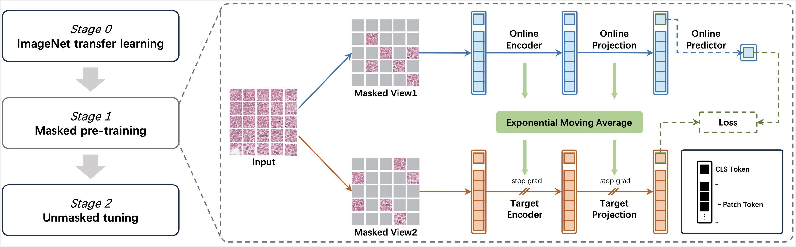

# Rapid Histopathology Pre-training (RHP)
The official code of 《Efficient Multi-Stage Self-Supervised Learning for Pathology Image Analysis via Masking》




# Installation
```
conda create -n RHP
conda activate RHP
pip install -r requirements.txt
```


# Train

#### Data Preparation
All data in the code is stored in LMDB format to avoid file fragmentation. 
Given a folder_path containing images, the method to obtain LMDB files is as follows:

```
from util.dataset import folder2lmdb
folder2lmdb(folder_path, lmdb_path)
```

#### Stage 0 and 1: masked pre-training
imagenet_pretrained_ckpt is the ImageNet pre-trained model, which can be obtained using timm.

```
python train.py --db_path lmdb_path --ckpt imagenet_pretrained_ckpt --mask_ratio 0.75 --bs your_batch_size
```

#### Stage 2: unmasked tuning

stage1_pretrained_ckpt is the checkpoint obtained from stage1 training

```
python train.py --db_path lmdb_path --ckpt stage1_pretrained_ckpt --mask_ratio 0 --bs int(your_batch_size*0.25)
```


# Pre-training and Validation Data Download Link

| Dataset                  | Download Link |
|--------------------------|--------------|
| TCGA                     | [Link](https://www.cancer.gov/tcga) |
| CPTAC                    | [Link](https://www.cancerimagingarchive.net/browse-collections) |
| PatchCamelyon            | [Link](https://zenodo.org/record/2546921) |
| BreakHis                 | [Link](https://web.inf.ufpr.br/vri/databases/breast-cancer-histopathological-database-breakhis) |
| ColorectalHistologyMNIST | [Link](http://doi.org/10.5281/zenodo.53169) |
| NCT-CRC-HE               | [Link](https://zenodo.org/records/1214456) |
| CRC-TP                   | [Link](https://www.kaggle.com/datasets/haashaatif/crc-tissue-phenotyping-crc-tp-dataset) |
| MoNuSeg                  | [Link](https://monuseg.grand-challenge.org/Data) |
| GlaS                     | [Link](https://www.kaggle.com/datasets/sani84/glasmiccai2015-gland-segmentation) |
| Camelyon16               | [Link](https://camelyon17.grand-challenge.org/Data) |


# Acknowledgement
This repository is built using the [BYOL](https://github.com/lucidrains/byol-pytorch) repository and the [MAE](https://github.com/facebookresearch/mae) repository.
